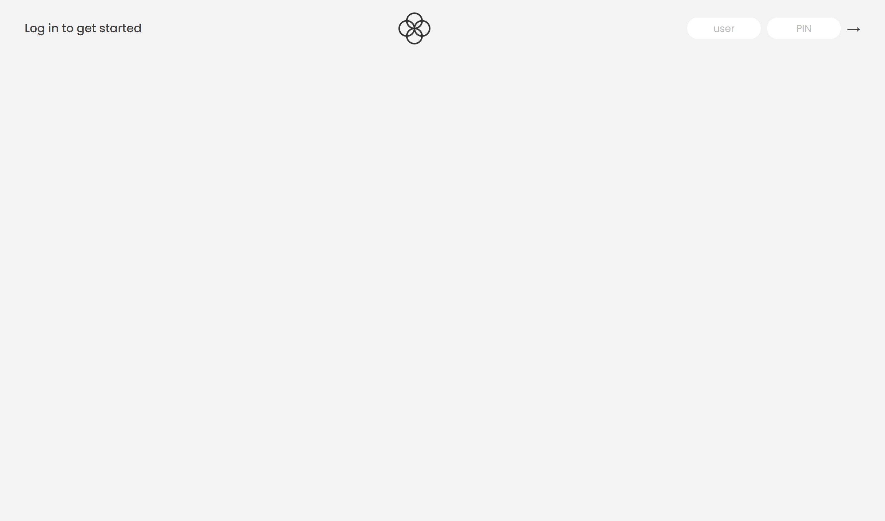

# Bank interaion page

- Live Site URL: [Live site](https://tiffanyleecodes.github.io/Bank-interation-page/)

### Overview

- See hover state for all interative elements. (Button)

- Login and transfer money via button and input field.

\*This is course from Udemy JS course and design copy right belongs to Jonas Schmedtmann.

- Login information:

  - 1.user : js, pin: 1111;
  - 2.user : jd, pin: 2222;
  - 3.user : stw, pin: 3333;
  - 4.user : ss, pin: 4444;

### Screenshot

### Built with

- Semantic HTML5 markup
- CSS custom properties
- Flexbox
- JS DOM

## Author

- Frontend Mentor - [@Tiff Lee](https://www.frontendmentor.io/profile/tifflee7784)
- Twitter - [@Tiffany Lee](https://twitter.com/CodeTiffanyL)
- Profolio - [@Tiffany Lee](https://tiffanyleecodes.github.io/)
